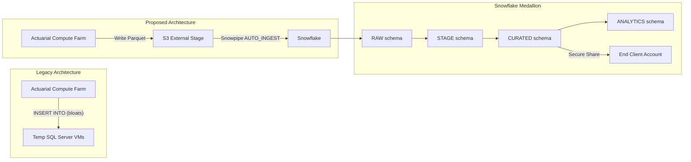

# Result Set Publication - Snowflake Demo Project

## Context

A financial analytics vendor runs a legacy actuarial engine (written in C) on a distributed compute grid. Today, results are written to temporary SQL Server VMs that bloat and fail at scale. The demo proves Snowflake can replace that bottleneck by ingesting Parquet files written directly from the compute farm to S3.

The primary end-client demand is granular IFRS 17 / US GAAP (LDTI) data at scale (~30TB).

## Architecture



## Project Structure

```
Loading.Data/
  .gitignore              # Exclude references/, credentials, etc.
  README.md               # Project overview and quick start
  PLAN.md                 # This plan (demo design doc)
  sql/
    00_setup.sql          # Database, schemas, warehouses, roles
    01_stages_formats.sql # S3 stage, Parquet/CSV file formats
    02_csv_optimization.sql  # Immediate tactical fix: CSV partitioning best practices
    03_load_parquet.sql   # COPY INTO for sample Parquet files (Phase 1 demo)
    04_snowpipe.sql       # Snowpipe AUTO_INGEST for continuous Parquet ingestion
    05_transforms.sql     # Streams + Tasks for actuarial data transforms
    06_dynamic_tables.sql # Alternative: declarative transforms via Dynamic Tables
    07_data_sharing.sql   # Secure Data Sharing for curated results to end client
    08_cost_monitoring.sql # Resource monitors, credit tracking
    09_scale_planning.sql # 30TB planning, clustering, optimization (Phase 2 notes)
    99_cleanup.sql        # Tear-down script
  python/
    requirements.txt      # snowflake-snowpark-python, pandas, pyarrow
    utils/
      generate_data.py    # Generate realistic actuarial Parquet samples
      __init__.py
  data-samples/
    README.md             # Description of sample data
    # Generated .parquet and .csv files go here
  docs/
    SE-GUIDE.md           # Demo prep and talk track for the SE
    scale-30tb.md         # 30TB best practices doc (talking points)
    snowpark-cpp-roadmap.md  # Snowpark C++ migration narrative
  references/             # (excluded from git)
```

## Data Model - Actuarial Domain

### RAW schema (Bronze) - ingested as-is from Parquet/CSV

- **`ACTUARIAL_RESULTS_RAW`** - Core actuarial engine run outputs (Parquet)
  - `RUN_ID`, `SCENARIO_ID`, `MODEL_POINT_ID`, `COHORT_ID`
  - `VALUATION_DATE`, `REPORTING_STANDARD` (IFRS17 / USGAAP)
  - `PRESENT_VALUE_FUTURE_CASHFLOWS`, `CONTRACTUAL_SERVICE_MARGIN`
  - `LOSS_COMPONENT`, `RISK_ADJUSTMENT`, `BEST_ESTIMATE_LIABILITY`
  - `INSURANCE_REVENUE`, `INSURANCE_SERVICE_EXPENSE`

- **`CASHFLOW_PROJECTIONS_RAW`** - Projected cash flows per model point (Parquet)
  - `RUN_ID`, `MODEL_POINT_ID`, `PROJECTION_MONTH`
  - `PREMIUM_INFLOW`, `CLAIM_OUTFLOW`, `EXPENSE_OUTFLOW`
  - `INVESTMENT_INCOME`, `NET_CASHFLOW`, `DISCOUNT_FACTOR`

- **`RUN_METADATA_RAW`** - Run configuration and status (CSV/JSON)
  - `RUN_ID`, `RUN_START_TS`, `RUN_END_TS`, `STATUS`
  - `MODEL_VERSION`, `SCENARIO_COUNT`, `MODEL_POINT_COUNT`
  - `NODE_COUNT`, `TOTAL_COMPUTE_SECONDS`

### STAGE schema (Silver) - enriched

- **`RESULTS_ENRICHED`** - Joined with run metadata, calculated fields (e.g., unit costs, parity checks)

### CURATED schema (Gold) - aggregated

- **`COHORT_SUMMARY`** - Aggregated by cohort/reporting standard
- **`RUN_COMPARISON`** - Cross-run delta analysis

## SQL Script Details

### `00_setup.sql`
- Role: `ACTUARIAL_LAB_ROLE`
- Database: `ACTUARIAL_LAB_DB`
- Schemas: `RAW`, `STAGE`, `CURATED`, `ANALYTICS`
- Warehouses: `ACTUARIAL_INGEST_WH` (XS), `ACTUARIAL_TRANSFORM_WH` (S), `ACTUARIAL_ANALYTICS_WH` (S)
- All initially suspended, auto-suspend 60s

### `01_stages_formats.sql`
- File formats: `FF_PARQUET_RESULTS` (Parquet), `FF_CSV_RESULTS` (CSV with header, field-enclosed, NULL handling)
- External stage: `RAW_S3_STAGE` using `S3_INT` storage integration
- Same S3 integration pattern as reference project

### `02_csv_optimization.sql` (Tactical fix)
- CSV partitioning best practices (file sizing, row-group alignment)
- `COPY INTO` with `ON_ERROR`, `SIZE_LIMIT`, `PURGE` options
- Parallel loading with multiple warehouses
- `MATCH_BY_COLUMN_NAME` for flexible column ordering
- `VALIDATION_MODE` for dry-run testing
- Error handling with `COPY_HISTORY` and `VALIDATE` functions
- Guidance on optimal file sizes (100-250 MB compressed)

### `03_load_parquet.sql` (Phase 1 demo)
- `COPY INTO` for the 3 raw tables from sample Parquet files on S3
- `MATCH_BY_COLUMN_NAME = CASE_INSENSITIVE` for Parquet
- Verification queries showing row counts and sample data

### `04_snowpipe.sql`
- Snowpipe definitions for each raw table with `AUTO_INGEST = TRUE`
- SQS notification setup instructions
- Monitoring queries: `SYSTEM$PIPE_STATUS`, `COPY_HISTORY`, `PIPE_USAGE_HISTORY`
- Commentary on Snowpipe cost at 30TB scale

### `05_transforms.sql`
- Streams on RAW tables (`APPEND_ONLY = TRUE`)
- Tasks: `TASK_ENRICH_RESULTS` (consumes stream, writes to `RESULTS_ENRICHED`), `TASK_AGGREGATE_COHORTS` (AFTER, writes to `COHORT_SUMMARY`)
- Enrichment logic: join results with metadata, compute derived metrics

### `06_dynamic_tables.sql`
- Alternative to Streams+Tasks
- `RESULTS_ENRICHED_DT` with `TARGET_LAG = '1 minute'`
- `COHORT_SUMMARY_DT` with `TARGET_LAG = '5 minutes'`

### `07_data_sharing.sql` (Result Publication)
- Create a Secure Share containing curated views (`COHORT_SUMMARY`, `RUN_COMPARISON`)
- Grant access to specific objects; demonstrate how the end client would see the share
- Show Secure Views to restrict row-level access by reporting standard or cohort
- Commentary on Snowflake Marketplace as a future distribution option

### `08_cost_monitoring.sql`
- Resource monitors (same pattern as reference)
- Credit consumption queries filtered to `ACTUARIAL_*` warehouses

### `09_scale_planning.sql`
- Sizing calculations for 30TB ingestion
- Clustering key recommendations for actuarial query patterns
- Multi-cluster warehouse guidance for concurrent analyst queries
- Snowpipe vs COPY INTO cost comparison at scale
- **Phase 2 note:** generating 30TB of synthetic Parquet data on S3 for realistic-scale load testing is a follow-on effort

### `99_cleanup.sql`
- Suspend tasks, drop everything

## Data Generator (`python/utils/generate_data.py`)

Generates realistic sample Parquet files with:
- ~100 model points across 3-5 cohorts
- 2 reporting standards (IFRS17, USGAAP)
- 3-5 scenarios per run
- Cashflow projections (360 months per model point)
- Realistic actuarial values (present values, CSM, loss components)
- Multiple runs to simulate incremental ingestion

Output files:
- `data-samples/actuarial_results_run001.parquet`
- `data-samples/cashflow_projections_run001.parquet`
- `data-samples/run_metadata.csv`

## Demo Talk Track (docs/SE-GUIDE.md)

**Phase 1 - Credibility (10 min):** CSV optimization for immediate data-loading pain
**Phase 2 - Core Proposal (20 min):** Load Parquet files, set up Snowpipe, show transforms
**Phase 3 - Data Sharing (10 min):** Publish curated results to end client via Secure Data Sharing
**Phase 4 - Scale Discussion (10 min):** 30TB planning, clustering, cost modeling
**Phase 5 - Future Vision (5 min):** Snowpark for C++ as eventual home for actuarial calculation logic

## Key .gitignore Additions (vs reference)

- `references/` folder excluded (already present as `reference/` in reference; we use `references/`)
- Same credential/secret exclusions
- Same dbt/Python/IDE exclusions

## Implementation Todos

- [ ] Initialize git repo, create .gitignore (excluding references/ and credentials)
- [ ] Create sql/00_setup.sql - database, schemas, warehouses, roles for actuarial domain
- [ ] Create sql/01_stages_formats.sql - S3 stage, Parquet/CSV file formats, raw tables
- [ ] Create sql/02_csv_optimization.sql - CSV partitioning best practices
- [ ] Create sql/03_load_parquet.sql - COPY INTO for Parquet files (Phase 1 demo)
- [ ] Create sql/04_snowpipe.sql - Snowpipe AUTO_INGEST for continuous Parquet ingestion
- [ ] Create sql/05_transforms.sql - Streams + Tasks for actuarial data enrichment
- [ ] Create sql/06_dynamic_tables.sql - Alternative declarative transforms
- [ ] Create sql/07_data_sharing.sql - Secure Data Sharing for curated results to end client
- [ ] Create sql/08_cost_monitoring.sql - Resource monitors and credit tracking
- [ ] Create sql/09_scale_planning.sql - 30TB planning queries and optimization (note Phase 2)
- [ ] Create sql/99_cleanup.sql - Tear-down script
- [ ] Create python/utils/generate_data.py - Actuarial Parquet sample data generator
- [ ] Create python/requirements.txt
- [ ] Create docs/SE-GUIDE.md - Demo prep and talk track for the SE
- [ ] Create docs/scale-30tb.md - 30TB best practices talking points
- [ ] Create docs/snowpark-cpp-roadmap.md - Snowpark C++ migration narrative
- [ ] Create README.md - Project overview, architecture, quick start
